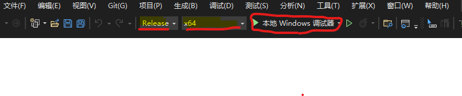

# Env Configure

## Environmental construction

Choose one of the following two options

### 1、EasyX official website：[EasyX](https://easyx.cn/)

For detailed configuration, please refer to the steps on the EasyX official website

### 2、Using EasyX within the project

Configure the library header file directory

Configure Link Options

### Run Project

