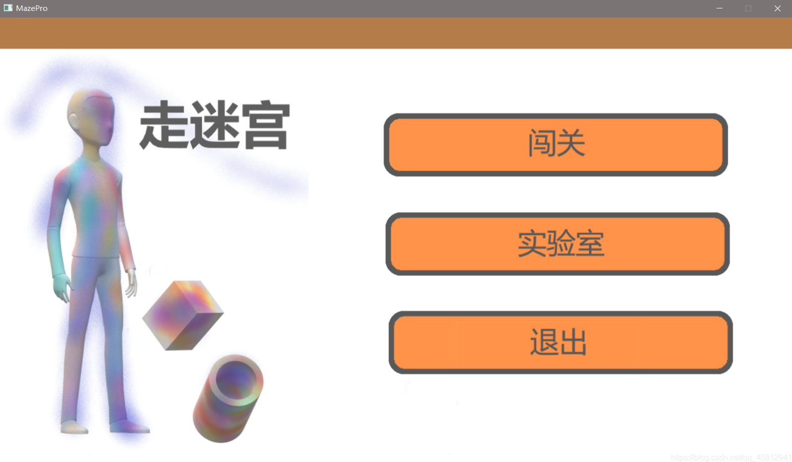
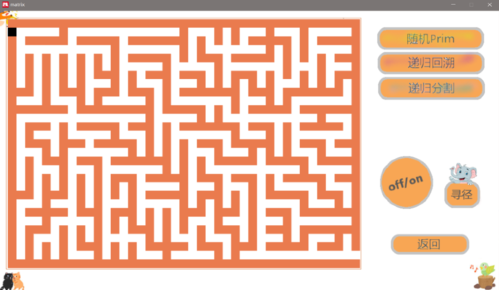
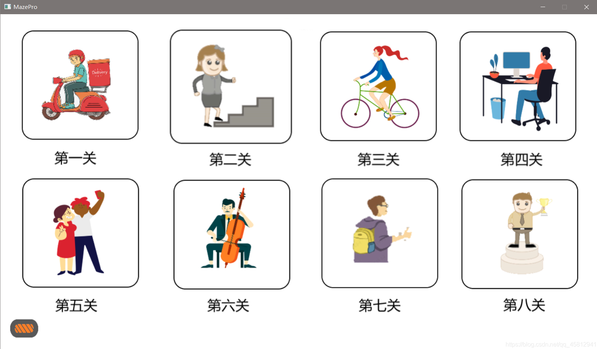
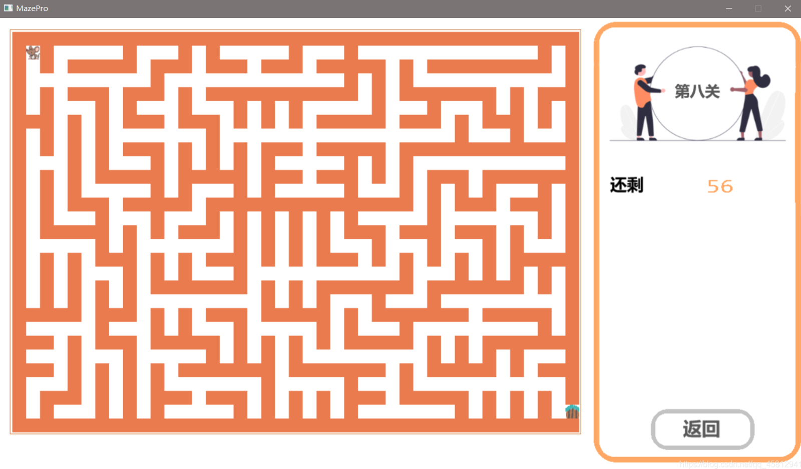

# maze

A simple Windows maze game written in C++, supporting functions such as random maze generation and maze path finding

Open the project using Visual Studio and proceed to the next step to obtain EasyX

## Game features

- Home page
  Challenge, Lab, Exit Selection
- Challenge
  level selection, maze file loading
- Laboratory
  Random Prim, Recursive Backtracking, Recursive Segmentation, Maze Inversion, Shortest Path

## Environment And Debugging

[Environment And Debugging](./Env.md)

## Interface display

- Game operation plan

Using the keyboard wasd to move the target body

- Game homepage

- Game Lab Interface

- Challenge menu

- Pass through levels

## Thanks

Thank you to the developers of the EasyX graphical interface library: Without your efforts, we cannot use such good tools for efficient development
